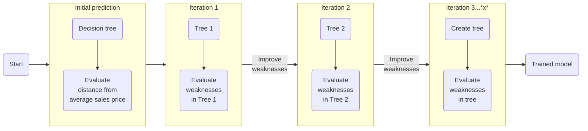
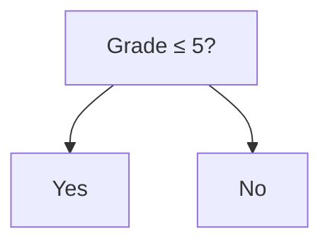
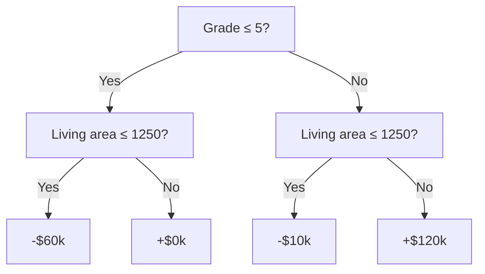
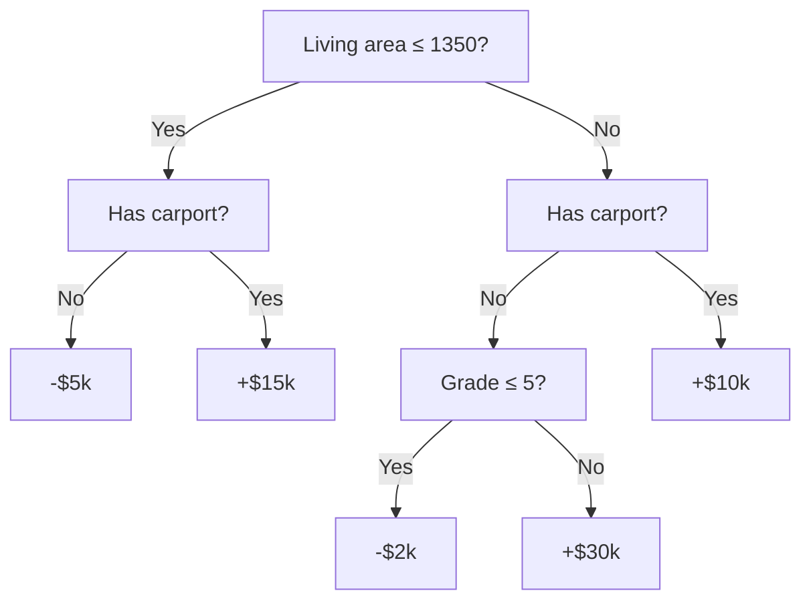

Property Appraisal generates property valuations using AI Automated Valuation Models (AI AVMs). 
The AI AVM leverages a machine learning (ML) algorithm known as Gradient-Boosted Decision Trees (GBDTs) to identify non-linear relationships between property characteristics and sale price.

Through successive decision trees, gradient boosting trees fit data much closer than a linear regression model.
This approach is more robust than other methods of valuing properties for the following reasons:

* **Review millions of properties**: Machine learning models can quickly compare properties at scale.
* **Identify subtler influences to property value**: This model includes all property details and uses patterns to determine which details contribute to the total property value. The AVM identifies features that influence the overall price, even if they are unintuitive.
* **Refine value through successive iterations**: By iterating on each tree to find the weakest parts of the estimate, the model successively refines its valuation to reach the actual value. This process is more efficient and more accurate than traditional methods of estimating the value, such as sales comparisons.
* **Calculate non-linear relationships between characteristics and sale price**: Linear regressions include fixed coefficients to determine the value of a home. Many variables, such as quality and living area, don't match a linear model.
* **Build correlations between property characteristics**: Linear regressions assume that property characteristics do not impact each other. However, GBDTs can identify connections between characteristics, such as whether the geographic location impacts the value of a pool.

To understand gradient boosting, you must first understand how C3 AI develops enterprise-grade AI models. 
This topic walks you through how the application uses GBDTs to determine a property valuation.

## Intro to AI

AI trains computers to perform complex tasks.
To teach computers how to perform these tasks, a data scientist trains a **model**, a process that uses rules to determine outcomes. 
In this case, the rules are the GBDTs and the outcome is a property valuation.

AI requires three types of data for a model like gradient boosting:

* Training data
* Validation data
* Test data

The quality of data in these three categories impacts the model's prediction quality.
You must have an adequate amount of data to fill all three pools.

### Prepare data for the model

Before any training or testing, someone must prepare the data. 
This preparation includes the following steps:

1. **Assess quality**: The data must be up-to-date and include all necessary fields. In the case of property appraisal, necessary fields could be sale price, lot size, number of bedrooms, and any other property characteristics.
1. **Review relationships**: The Property Appraisal team might explore the correlations between your data and the result. For example, a data scientist would ask how square footage or location influence a property's sale price.
1. **Transform data**: The data must be uniform before a model can use it. For example, if one data source refers to the sale price as "sales price" and another refers to it as "sales value," Property Appraisal combines both fields into one field with a consistent name.

### Train a model

To teach the model to accurately predict the value of a property, you start with a set of **training data**. 
Training data is a set of items labeled with the correct outcome. 
For the Property Appraisal AI AVM, the training data is a subset of the prepared data. 

During training, the model establishes a relationship between the sale price and the following:

* Property characteristics
* Geographic Information System (GIS) data
* Market trends

These elements are known as features. 
A **feature** is a property or characteristic that contributes the to the evaluation of the data.

The sale price is a label. A **label** is the correct judgement for the piece of data.

The goal of the model is to correctly predict the value of the label. 
The model searches for patterns in the features to reach a valuation that matches the fair market value (the label).

Consider the following two houses as part of a training data set.

| Feature | House 1 | House 2 |
|-----|---------|---------|
| Condition grade | 3 | 5 |
| Living area | 1300 sqft | 2000 sqft |
| Garage type | Carport | Garage |
| Has pool | No | Yes |

**Labels**
* **House 1 sale price**: $150,000
* **House 2 sale price**: $240,000

The model analyzes all the houses in the training data to decide which features are relevant and how much money they contribute to the value of the house.

> [!IMPORTANT]
> Although the model uses sale price as the label, sale price is *not* the final output of this model.
> The model uses sale price as a baseline for determining fair market value for any given property.
> Sale price fluctuations over time can cause the fair market value to shift—especially if the property last sold over a decade ago.
> This is why it's important to use up-to-date sale prices when training the AI AVM.

### Test the model

After training, data scientists submit **test data** to evaluate the accuracy of the model's predictions. 
In this case, data scientists compare property valuation predictions with the actual sales prices to determine whether the predictions fall within an acceptable margin of error.

If the model can correctly estimate the value of the test properties within a small margin of error, the model is considered **trained**, or ready to deploy.

## AI AVM uses Gradient-Boosted Decision Trees

The C3 AI Property Appraisal application uses Gradient-Boosted Decision Trees (GBDTs) to estimate the value of a property. 
A **decision tree** is a set of true-or-false questions to decide the value of an object, in this case, the market value of a property.
**Gradient boosting** analyzes each decision tree for weaknesses.
The model then builds another tree to address those weaknesses.

The following diagram shows the flow of this process.

Recall the training data for two houses that sold last year:

* House 1 sold for $150,000.
* House 2 sold for $240,000.

Review the following features of these two single family homes.

| Feature | House 1 | House 2 |
|-----|---------|---------|
| Condition grade | 3 | 5 |
| Living area | 1300 sqft | 2000 sqft |
| Garage type | Carport | Garage |
| Has pool | No | Yes |

This topic uses these sample values to show how C3 AI Property Appraisal trains a GBDT.

### Step 0: Start the training model

To start, the model sets an initial prediction that every property has the value of the average sales price of the training data set.
Most, if not all, properties have a sales price that does not match this prediction.
The model's accuracy therefore does not reach the acceptable threshold.

The model then calculates the difference between the prediction and the actual sales price for every property in the training data.
The difference between the sales price and the average is the **target** value.

Each iteration attempts to lower the target to zero for every property.

Say the average is $180,000 sales price for the data set.
The example properties have the following targets:

$$
salePrice - globalAvg = Target
$$

**House 1 Target**: $\$150000-\$180000= -\$30000$

**House 2 Target**: $\$240000-\$180000=\$60000$

The AI model must now build upon the initial prediction using the features from the training data set. 
The model attempts to identify which combination of features results in the most accurate prediction of the property valuation, which then minimizes the difference between sales price and the predicted value.

Every tree attempts to lower this difference, the target, to zero.

### Step 1: Identify the first gradient-boosted tree

The model reviews every feature of the properties in the training data to find the starting point for the first gradient-boosted decision tree. 

A **decision tree** is a set of yes-or-no decisions that partitions data into buckets. For example, a tree that separates properties by living area might look like the following: 

In this example, the model reviews **grade**, **living area**, **garage type**, and **has pool**. 
Whichever feature best partitions the data becomes the first feature in the GBDT.

To identify the best starting point, the model creates a small decision tree for each feature.
The model calculates the average sale price of each property in the `Yes` and `No` buckets, respectively. 

It then finds the difference between each property's sales price and average sales price for the bucket.
Whichever decision tree places properties closest to the average becomes the start of the first tree.

### Step 2: First tree creation and evaluation

Say the model determines that the condition grade best partitions the properties. 
It then creates the first tree, combining grade and the size of the living area to estimate the price of properties.

This tree adds or subtracts values to the initial prediction to estimate:

**House 1**: 
$$
\$180000-\$60000=\$120000
$$
$$
target=\$150000 - \$120000
$$
$$
target=\$30000
$$

House 1 now has a $30k target.

**House 2**: 
$$
\$180000+\$120000=\$300000
$$
$$
target=\$240000 - \$300000
$$
$$
target=-\$60000
$$

House 2 now has a -$60k target.

### Step 3: Second tree creation and evaluation

The model is close to the actual sales values, but not correct yet. 
House 1 is $30k away from the sales price and House 2 is $60k away from the sales price.

To improve the estimate, the model creates a new tree to get closer to the actual sales value of each house.
In this example, the model then creates a new tree based on the living area to better approach the sale value.

> [!NOTE]
> The decisions on each side of the tree don't necessarily match at every level.
> The model might find that some types of homes need different decisions at different levels to better predict the value.

Now the model estimates House 1 to be $135,000 and House 2 to be $235,000.
Both houses are closer to the sales price, but neither has reached their sales price.

The model therefore builds another tree.

### Successive iterations

Depending on how far the other properties' predicted values are from their sales prices, the model may continue building trees to better match the sales price.

The AI model builds successive trees to minimize the difference between the sales price and the predicted value across all properties in the data set. 
Often this means the model builds thousands of trees. 

Once it reaches a threshold of acceptability, the AI model is ready to review new properties.

### Model deployment

A trained AI model is ready to predict property values for new transactions.
For any new transaction, the model runs the property through the series of decision trees built during training to predict the property value. 

It then offers the AI AVM based on the results.
