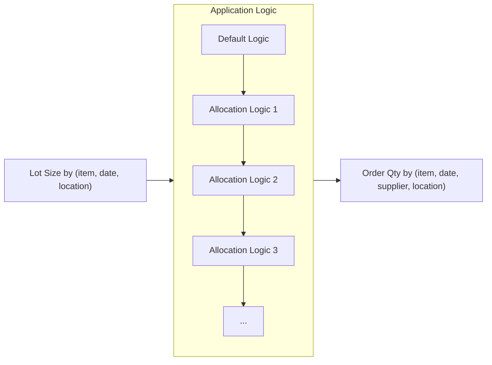

Supply allocation is a rules-based approach to allocate available internal and external supply. 
This allocation fulfills raw material replenishment requirements based on predefined rules.
You can configure allocation logic for each ItemFacility object.

After creation, the supply allocation process follows this order:

1. Lot Size by item, date, or location.
2. Application logic rules.
3. Order quantity rules.

The following diagram shows how the system applies the allocation rules:



## Step 1: Create supply allocation rules

To create allocation logic, first create an ItemFacilitySupplyAllocationSpec. 
You must specify the order type, condition, and supplier quantities.

The following code snippet shows how to create a spec.

```js
ItemFacilitySupplyAllocationSpec.make({
  orderType: 'PurchaseOrder',
  condition: "quantity>=100, quantity<=200, unit=='kilogram'",
  supplierQuantities: [SupplierQuantity.make({ 
    supplierId: 'Supplier1',
    percentageQty: 1
  })],
});
```

Consider the following fields:

* `orderType`: A string that can be either `PurchaseOrder` or `ProductionOrder`.
   * **Purchase order**: An item-level request including item cost, quantity, from locations, and requested delivery date. Each purchase order can include multiple purchase order lines.
    * **Production order**: A job that can be scheduled or assigned. This job can be a series of tasks, such as the assembly of a product or the creation of multiple products. Production orders are also known as work orders or process orders.
* `condition`: A string that lists the rules. Separate each rule with a comma. Use standard math operators(`>`, `<`, `>=`, `<=`, `==`) to compare values. You can compare the following fields:
    * `unit`
    * `quantity`
    * `requestDeliveryDate`
    * `orderCreationDatetime`
* `supplierQuantities`: An array of SupplierQuantity objects. These objects include the supplier ID and the percentage of order quantity your application relies on that supplier for. All of the `percentageQty` values in the list must sum to 1.

## Step 2: Attach rules to an ItemFacility object

Attach the ItemFacilitySupplyAllocationSpec to an ItemFacility using the `createRules()` method. 
The following code snippet models how to use this method:

```js
var itemFacSpec = ItemFacilitySupplyAllocationSpec.make({
  orderType: 'PurchaseOrder',
  condition: "quantity>=100, quantity<=200, unit=='kilogram'",
  supplierQuantities: [SupplierQuantity.make({ 
    supplierId: 'Supplier1',
    percentageQty: 1
  })],
});

//Submit the id of the ItemFacility and the ItemFacilitySpec to create the rules
ItemFacilitySupplyAllocation.createRules('<itemFacId>', itemFacSpec);

```

> [!IMPORTANT]
> You must enter the `id` field of the ItemFacility object—not the `itemFacilityId`—to create the rules for this ItemFacility.

`createRules()` validates the rules and confirms that the `percentageQty` values from the `supplierQuantities` array sum to 1.
If the spec is valid, the `rules` field on the given ItemFacility will be set to the condition.

## Step 3: Run supply allocation rules

You can use either of the following commands to create new order lines:

* `ItemFacilitySupplyAllocation.runRulesForItemFacility('<itemFacilityId>')`: Run rules for a single ItemFacility. This function accepts the `id` field of an ItemFacility instance.
* `ItemFacilitySupplyAllocation.runRulesForItemFacilities(<listOfItemFacilityIds>)`: Run rules for a list of ItemFacility instances. This function accepts a list of `id` values for the ItemFacility rules you'd like to run.

### Batch ItemFacility supply allocation jobs

You can process the rules and create order lines on multiple ItemFacility objects in batch jobs.
Configure the batch size in ItemFacilitySupplyAllocationBatchJobOptions.
The default batch size is 10.

The following code snippet starts a batch job with a batch size of 5.

```js
//Create an object that specifies 5 as the batch size
var options = ItemFacilitySupplyAllocationBatchJobOptions.make({
  batchSize: 5
});
//Start the batch job with a batch size of 5
var job = ItemFacilitySupplyAllocationBatchJob.startJob(options);
```
